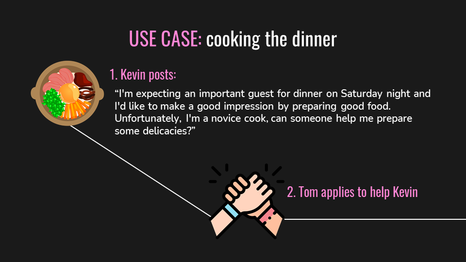

# Favors MobileApp

The goal of the application is to allow users to "ask for favors" by publishing a post which mainly describes a need and the associated reward for those who can satisfy that need.
The goal from a technology point of view is to make the best use of the services provided by Microsoft's cloud which is Azure.

## Use Case

## How the App looks like

## General Architecture
- A client app, in particular a mobile client since the mobile platform was chosen as a point of interaction with the user.
- The client app uses the Azure App Service which allows you to provide typical features of a mobile app and also allows a simple interaction with the Azure SQL database which is the data source of the application.
- Alongside these basic services, the Azure Cognitive Services service is used, which allows the use of artificial intelligence algorithms without a high level of knowledge of the same, and Azure Functions that implement the serverless paradigm.

## Building blocks implementations
- <b> Azure App Service - Mobile App </b> implementation -> https://github.com/nicolaDeCristofaro/AzureMobileBackend_node_favorsApp
- <b> Azure Function </b> implementation -> https://github.com/nicolaDeCristofaro/AzureFunction_KeywordsGenerator_favorsApp
- <b> Azure SQL Database </b>
- <b> Azure Cognitive Service - Content Moderator </b>
- <b> Azure Cognitive Service - Keywords Extractor </b>
